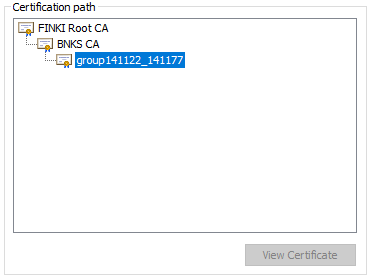

# University web application (needs refactoring)

Our web application is an online grading system for students. The system serves as an online student index. There are three types of users: students, professors and system administrators.

Students have an overview of all grades that have been received by a particular subject, and also have an overview of all the semesters they enrolled from the period when they are students till now.
aa
Professors use the system as an overview of all subject they have teached at a certain semester in all years after they teach at faculty. Professors have the opportunity to input a grade on their subject, to those students who have passed the course.

Administrators are in charge of creating new subjects, assignment certain subjects to professors, and creating new semesters for students.

**Configuring a virtual machine and generating certificates**

By using [vagrant](https://www.vagrantup.com/), which allows fast and simple operation of a virtual machine, we launched a virtual *ubuntu/trusty64* operating system. Virtual machine listen on private port **192.168.33.10**, and this IP address is mapped(locally) with **www.university.com** which will represents the DomainName of our web application.

On this virtual machine is installed **apache2 http** server that needs to provide secure communication as well as client authentication with client certificates, between clients and the server.

For this purpose, with ***openssl*** tool and group certificate (**group141122\_141177**) representing Intermediate\_CA and is signed by BNKS\_CA (FINKI Intermediate CA), we generated server and client certificates.

At the server certificate *CommonName* it must be the same with DomainName, but also should have extension *SubjectAlternativeName* in which it will specify all domain or IP addresses that will cover this certificate.

There are three types of client certificates that differ in **OrganizationUnit** section of **x509Certificate** standard. **OU** section determines whether it is:

-   Student certificate (OU=FinkiStudent)

-   Professor certificate (OU=FinkiProfessor)

-   Administrator certificate (OU=FinkiAdministrator)

Client certificates are exported to .p12 files and they are installed in web browser.

Also, on the web browser we also installed the group certificate as  **Trusted Root CA**. With this, the web browser has formed a trusted chain to **FINKI Root CA**.

**Configuration of Apache2 HTTP server**

On the apache server we have enabled the **ssl** module in order to be able to configure the **https** protocol.

The server has two VirtualHosts. First listen on port :80 and redirects all requests which comes to this port, to continue on :443 port

The virtual host that listens on port :443 enables secure communication through HTTPS. This host configures the paths to the server certificate, and its key, and the chain that is composed of the group certificate concatenated with a chain followed by BNKS\_CA

With this configuration, https communication is enabled.

**Client Authentication**

Clients authenticate themselves to the server through their certificates. To make  this possible, it is necessary to enable the apache server **dav** and **dav\_fs** modules. With these modules allows client authentication, that is, when clients access certain resources which are protected, the server asks for a certificate so they can continue to access those resources.

The virtual hosts are configured for locations that are protected and which require different certificates to access them.

According to what kind of certificate the users possess, they will be able to access only certain locations on the server.

For example, location ***www.university.com/student*** can access only those users who have a student certificate ***(OU=FinkiStudent),*** but in addition, the certificate should be issued from *Group141122\_141177* *CA* and *Organization* should be **FINKI**.

This is achieved by enabling:

***DAV On*** =&gt; dav module on  

***SSLVerifyClient require*** =&gt; always the server requires a certificate from client

***SSLVerifyDepth 3*** =&gt; verification goes to the 3rd level (FINKI Root CA)  

***SSLOptions +ExportCertData*** =&gt; the certificate is forwarded to the next application, example tomcat

1.  
    
    I'm trying to access to www.university.com/student

2.  By sending the certificate I get access

    

3.  I can not access to *www.university.com/professor* with Student's Certificate

    

The virtual host is also able to track those certificates that are no longer valid.

**Connecting Apache2 HTTP with Tomcat 8.5**

In order to be able to display dynamic content, we made a connection on **apache** server to **tomcat** server through *ajp protocol*.

For this purpose, we needed to install the apache tomcat server on virtual machine.

On the apache http we enable the modules **mod\_proxy** and **mod\_proxy\_ajp** using **а2enmod**.

The apache http configuration looks like this, which means the forwarding of *www.university.com/professor* through ajp protocol to JavaSpring application that is installed on the tomcat server.

Ports 8080 and 8009 are blocked from outside in order not to be bypass apache http server.
