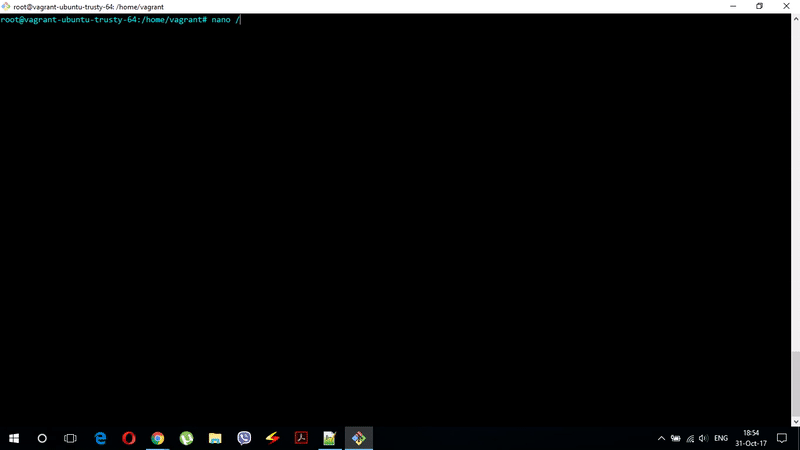

# University web application (needs refactoring)

Our web application is an online grading system for students. The system serves as an online student index. There are three types of users: **students**, **professors** and **system administrators**.

Students have an overview to all grades that they got for some particular subject, and also an overview to all the semesters they enrolled from the period when they became students until now.

Professors use the system as an overview of all subjects they have taught at a certain semester for all years, after having been professors at the faculty. Professors have the opportunity to enter a grade on their subject, to those students who have passed the course.

Administrators are in charge of creating new subjects, assignment certain subjects to professors, and creating new semesters for students.

**Configuring a virtual machine and generating certificates**

By using [vagrant](https://www.vagrantup.com/), which allows easy and simple operation with virtual machine, we launched a virtual *ubuntu/trusty64* operating system. Virtual machine listens on private port **192.168.33.10**, and this IP address is mapped (locally) to **www.university.com** and represents the *DomainName* of our web application.

On the virtual machine is installed **apache2 http** server that needs to provide a secure communication as well as client authentication with client certificates, between clients and the server.

For this purpose, using the ***openssl*** tool and the group certificate (**group141122\_141177**) which is representing an Intermediate\_CA signed by BNKS\_CA (FINKI Intermediate CA), a server and client certificates were generated.

At the server certificate *CommonName* must be equal to the *DomainName*, and should have a *SubjectAlternativeName* extension where should be specified all the domains or IP addresses that will be covered by this certificate.

There are three types of client certificates that differ in **OrganizationUnit** section of the **x509Certificate** standard. **OU** section determines whether it is:

-   **Student certificate** (OU=FinkiStudent)

-   **Professor certificate** (OU=FinkiProfessor)

-   **Administrator certificate** (OU=FinkiAdministrator)

Client certificates are exported to **.p12** files and they are installed in the web browser.

Also, on the web browser we also installed the group certificate as **Trusted Root CA**. By doing this, the web browser formed a trusted chain to the **FINKI Root CA**.

**Apache2 HTTP server configuration**

On the apache server we have enabled the **ssl** module in order to be able to configure the **https** protocol.

The server has two VirtualHosts. First listens on port **:80** and redirects all requests which comes to this port, to continue on **:443** port

The virtual host that listens on port **:443** enables a secure communication through HTTPS. This host configures the paths to the server certificate, and its key, and the chain that is composed of the group certificate concatenated with a chain followed by BNKS\_CA

By doing this configuration, the **https** communication is enabled.

**Client Authentication**

Clients authenticate themselves to the server through their certificates. To make this possible, it is necessary to enable the apache server **dav** and **dav\_fs** modules. These modules allow client authentication, that is, when clients access certain resources which are protected, the server will ask them for a certificate so they can continue to access those resources.

The virtual hosts are configured for locations that are protected and require different types of certificates to access them.

According to what kind of certificate the users have, they will be able to access only certain locations on the server.

For example, location ***www.university.com/student*** can be accessed only by users who have a valid student certificate ***(OU=FinkiStudent),*** but, in addition, the certificate should be issued by *Group141122\_141177* *CA* and *Organization* should be **FINKI**.

This is achieved by enabling:

***DAV On*** =&gt; dav module on  

***SSLVerifyClient require*** =&gt; always the server requires a certificate from client

***SSLVerifyDepth 3*** =&gt; verification goes to the 3rd level (FINKI Root CA)  

***SSLOptions +ExportCertData*** =&gt; the certificate is forwarded to the next application, example tomcat

1.  
    
    I'm trying to access www.university.com/student

2.  By sending the certificate I get access

    

3.  I cannot access *www.university.com/professor* with Student Certificate

    

The virtual host is also able to track those certificates that are no longer valid.

**Connecting Apache2 HTTP with Tomcat 8.5**

In order to be able to display dynamic content, we made a connection on **apache** server to **tomcat** server through *ajp protocol*.

For this purpose, we needed to install the apache tomcat server on virtual machine.

On the apache http we enable the modules **mod\_proxy** and **mod\_proxy\_ajp** using **а2enmod**.

The apache http configuration looks like this, which means forwarding the *www.university.com/professor* through ajp protocol to JavaSpring application which is running on tomcat server.

Ports 8080 and 8009 are blocked from outside, to disable bypassing the apache http server.
